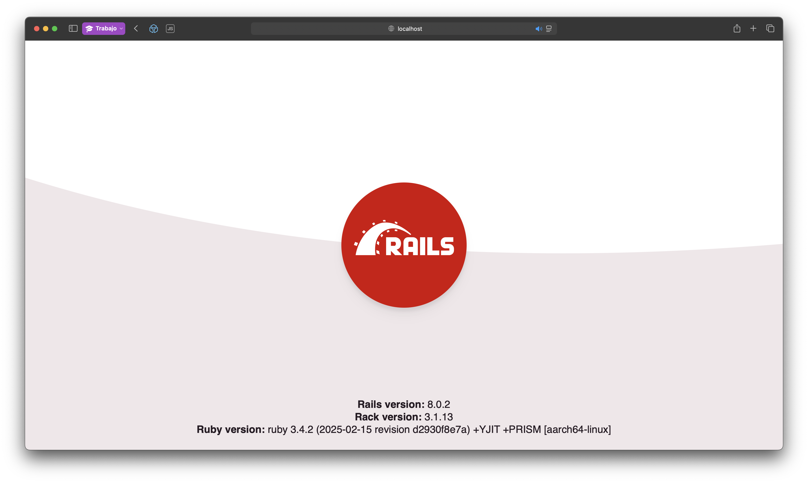

#  ChroNote  

## 📝 Descripción del Proyecto

ChroNote es una aplicación móvil de código abierto desarrollada por el equipo Ponchito’s Team, pensada para quienes necesitan gestionar su tiempo y su información de manera centralizada y eficiente. Está especialmente dirigida a estudiantes, docentes y personas con agendas apretadas que buscan una solución práctica para organizar sus actividades diarias.

En un entorno donde la productividad y la organización son esenciales, ChroNote ofrece una plataforma unificada que combina planificación horaria, recordatorios inteligentes y toma de notas contextualizada. Así, elimina la necesidad de usar múltiples aplicaciones para cada tarea, reduciendo la dispersión de datos y optimizando el acceso a la información clave.

## 🚀 Funcionalidades Clave

- Gestión de Horarios: Permite crear y visualizar horarios académicos o personales en vistas mensual, semanal y diaria.
- Notas Vinculadas a Eventos: Toma de notas asociadas automáticamente a una clase o actividad específica.
- Recordatorios Inteligentes: Notificaciones personalizables antes de cada evento, con detalles como asignatura, hora y lugar.
- Almacenamiento Seguro: La Base de Datos contará con la seguridad necesaria para la protección de los datos de nuestros usuarios
- Búsqueda Rápida: Filtrado por fecha, asignatura o palabras clave para acceder rápidamente a cualquier nota.
- Interfaz Intuitiva: Fácil navegación, diseño adaptado a móviles y tablets.

## 🗂️ Estructura del Proyecto

El repositorio contiene los siguientes archivos y directorios:

- **chronote/**: Directorio principal del proyecto, en este se encuentra el Software.
- **README.md**: Este archivo, que proporciona información sobre el proyecto.
- **backup.sql**: Este archivo contiene una copia de seguridad de la Base de Datos.

## 🛠️ Requisitos del sistema

Antes de clonar y compilar esta aplicación, asegúrate de cumplir con los siguientes requisitos:

### 📱 Dispositivo / Emulador
- Android 12.0 o superior  
- Al menos 1 GB de RAM recomendado  
- Resolución mínima: 720x1280

### 💻 Entorno de desarrollo
- Android Studio Giraffe o superior  
- SDK de Android 24 o superior instalado  
- JDK 17 (incluido en Android Studio por defecto)  
- Kotlin 1.9 o superior  
- Gradle 8.0 o superior (automático con Android Studio)

### 🧩 Dependencias necesarias
- Jetpack Compose
- Room Database
- ViewModel + LiveData o StateFlow
- Navigation Component
- Material Design 3
- Accompanist (si se usan animaciones, manejo de permisos, etc.)

> **Nota:** Las versiones específicas de las librerías pueden consultarse en el archivo `build.gradle`.
# API para conexión con la base de datos

* Ruby version
	* Para la creación de la api utilizamos la versión 3.4.2

* System dependencies
	* mysql2 ~> 0.5
	* rails ~> 8.0.2
	* puma 5.0
	* jbuilder
	* bcrypt ~> 3.1.7
	* tzinfo-data
	* solid_cache
	* solid_queue
	* solid_cable
	* bootsnap
	* kamal
	* thruster
	* debug
	* brakeman
	* rubocop-rails-omakase

## Configuración a través de Docker
* Clona el repositorio:

```
git clone https://github.com/Morche17/ChroNote.git
```

* Entra en el directorio:

```
cd ChroNote
```

* Se deben configurar las variables de entorno y credenciales. Contactar con [Morche17 (Emanuel Tavares)](https://github.com/Morche17).

* Inicializa el contenedor con: 

```
docker-compose up --build
```

* Después de levantar el contenedor, puedes entrar al navegador de tu preferencia y colocar ```localhost:3000``` para comprobar que el servidor está funcionando:



* Puedes probar un registro de usuario colocando esta petición con `curl` (si estás usando Linux o macOS):

```
curl -i -H "Content-Type:application/json" -X POST http://localhost:3000/api/v1/usuarios -d '{"usuario": {"nombre": "Usuario", "correo": "ejemplo@email.com", "contrasena": "secretisimo"}}'
```

## Configuración manual

Todas las dependencias se encuentran en el ```Gemfile```. Para instalarlas basta con escribir en terminal ```bundle install```.

### Creación de la base de datos
 
Necesita crearse una base de datos en mysql/mariadb con el nombre ```chronotebd_test```. Después hay que crear un usuario y contraseña para acceder a esa base de datos (si no quiere usar root). Por ejemplo:

>**Usuario**: chronoteadmin

>**Contraseña**: 1234567890

_Comando_: ```CREATE USER 'chronoteadmin'@'localhost' IDENTIFIED BY '1234567890';```

Después de crear el usuario con su contraseña debe darle privilegios de uso en la base de datos con ```GRANT ALL ON chronotebd_test.*  TO 'chronoteadmin'@'localhost';```

Finalmente hay que colocar las credenciales dentro del fichero ```config/database.yml``` donde debe quedar de esta forma:

```
default: &default
  adapter: mysql2
  encoding: utf8mb4
  pool: <%= ENV.fetch("RAILS_MAX_THREADS") { 5 } %>
  username: chronoteadmin # El usuario que se configuró
  password: 1234567890 # La contraseña (de preferencia no debe quedar visible)
  socket: /tmp/mysql.sock

development:
  <<: *default
  database: chronotebd_test

```

### Incialización de base de datos

Simplemente coloque el comando ```rails db:migrate``` dentro de la carpeta del proyecto para migrar el esquema de base datos a mysql/mariadb. Entrando con su usuario y contraseña, dentro de la base de datos se debería poder ver las tablas y sus atributos.

### Uso

Para probar la api simplemente inicie el servidor con ```rails s``` y puede probar peticiones como el registro de un usuario (usando unix): 

```
curl -i -H "Content-Type:application/json" -X POST http://localhost:3000/api/v1/usuarios -d '{"usuario": {"nombre": "Usuario", "correo": "ejemplo@email.com", "contrasena": "secretisimo"}}'
```

Puede realizar una consulta de todos los usuarios registrados en la base de datos entrando al navegador con la liga ```http://localhost:3000/api/v1/usuarios``` o consultarlo por id como por ejemplo al usuario con id 1 colocando ```http://localhost:3000/api/v1/usuarios/1```.
### 🔐 Permisos requeridos
- Acceso a almacenamiento interno (para guardar notas localmente)
- Permisos opcionales para notificaciones (si se usan recordatorios)


## 🗂️ Clonación del repositorio

Para clonar este repositorio en tu computadora, asegúrate primero de tener **Git** instalado.

### ✅ Requisitos previos (Git)

- **Linux**: Abre una terminal y ejecuta:
  ```bash
  sudo apt update
  sudo apt install git
- **Windows**: Descarga Git desde https://git-scm.com/download/win y durante la instalación selecciona la opción que te permite usar Git desde la línea de comandos.
Luego puedes usar PowerShell o Git Bash.
- **macOS**: Abre la Terminal y ejecuta:
  ```bash
  xcode-select --install

### 📥 Clonación del repositorio
- **Linux**: Abre la terminal y escribe:
  ```bash
  git clone https://github.com/Morche17/ChroNote.git
- **Windows**: Abre PowerShell o Git Bash y escribe:
  ```bash
  git clone https://github.com/Morche17/ChroNote.git
- **MacOS**: Abre la terminal y escribe:
  ```bash
  git clone https://github.com/Morche17/ChroNote.git
- Luego, entra a la carpeta del proyecto con:
  ```bash
  cd ChroNote


## 🛠️ Procedimiento de Instalación
En el área de `releases` hay un apk para instalación en android, puede descargar la primera versión de la aplicación y probarla entrando [aquí en este enlace](https://github.com/Morche17/ChroNote/releases/tag/v1.0.0)

## 💻 Tecnologías y Lenguajes Utilizados

El proyecto está compuesto por varios lenguajes de programación y tecnologías, entre los que se incluyen:

- C++ (37.9%)
- CMake (31.0%)
- Dart (23.9%)
- Swift (2.8%)
- C (2.2%)
- HTML (1.9%)
- Otros (0.3%)

## 👨‍💻 Equipo de Desarrollo

Este proyecto ha sido desarrollado por:

- [cano0-o (Alfonso Cano)](https://github.com/cano0-o)
- [JuanRoman01 (Juan Antonio Roman Castro)](https://github.com/JuanRoman01)
- [Morche17 (Emanuel Tavares)](https://github.com/Morche17)
- [Kush4o (Adam García Romero)](https://github.com/Kush4o)
- [Lok0Estrella (Isais Estrella)](https://github.com/Lok0Estrella)

## 📚 Documentación del Proyecto
Manual Tecnico:
https://drive.google.com/file/d/12xaFInsgxhfHSX5qn_Sv6t3MsJF0xkw5/view?usp=drive_link

Manual de Usuario:
https://drive.google.com/file/d/1_I7tdX8EjP2PFADIjlUqpnlRUWnal4Wg/view?usp=sharing
